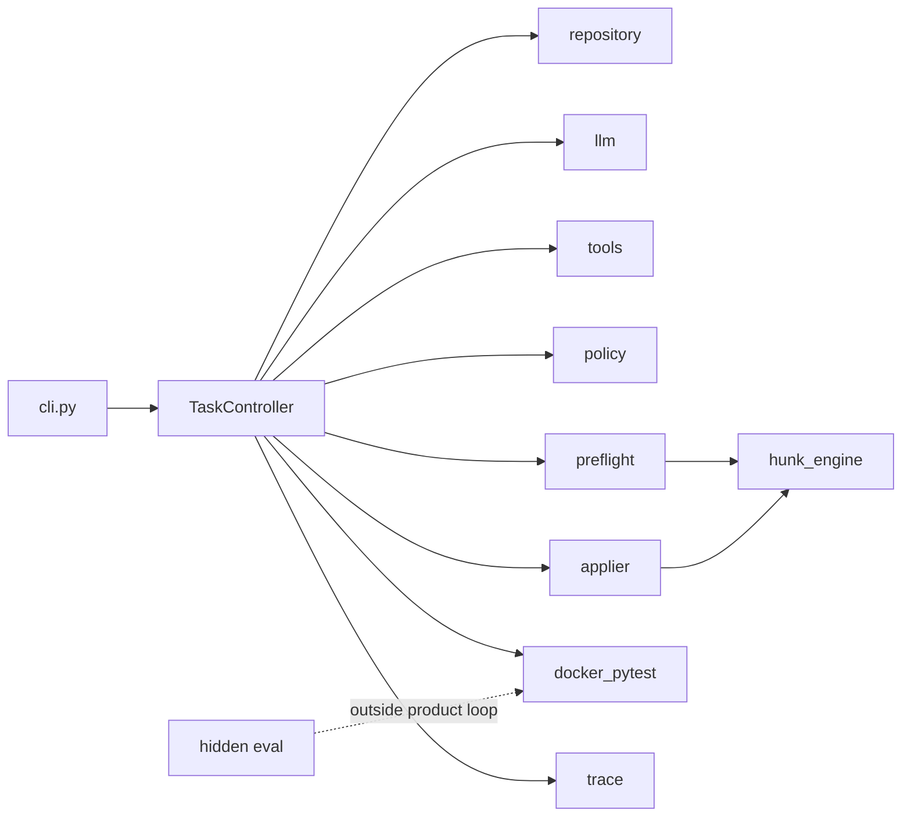

# SafePatch

[English](README.md) | [中文](README_zh.md)

SafePatch is a reliability-focused code-repair agent for small local
Python repositories that use pytest.

Given a repository path and a bug report or change request, SafePatch
creates an isolated working copy, builds a lightweight AST-based
repository map, runs a baseline test suite, and lets the model inspect
the repository through a restricted set of read-only tools.

Proposed unified diffs are validated against repository and test
integrity policies, checked with an exact patch preflight, and presented
for approval before they are applied. Approved changes are tested in a
network-disabled, resource-limited Docker container. Each session
exports the final diff, public and hidden evaluation logs, structured
metrics, and an append-only execution trace.

## Overview

SafePatch prioritizes **controllable repair** over open-ended autonomy.
The product path is intentionally narrow:

- one local Python + pytest repository at a time
- no shell, browser, or network tools for the model
- policy validation and exact patch preflight before approval
- Docker pytest as the sole correctness oracle for repair attempts
- product session status separated from hidden-test evaluation status

Current product tag: **v0.3.1** (exact patch preflight / patch regeneration; apply-failure classification).

## Motivation

LLM-generated unified diffs often fail for reasons other than incorrect
business logic: hallucinated context lines, policy-violating test edits,
or environment failures. If every failed apply is counted as a repair
attempt, sessions look like “the model cannot fix the bug” when the
failure was really **inapplicable patch text**.

SafePatch separates:

| Counter | Meaning |
|---|---|
| Format retries | Invalid JSON / tool schema |
| Patch regeneration | Legal proposal that fails exact preflight |
| Repair attempts | Patch applied successfully and pytest started |

## Key Capabilities

- Isolated `working_copy` import (source repository is not modified)
- AST repository map and bounded read-only tools
- Unified-diff proposals with path / size / test-integrity policy checks
- Exact patch preflight sharing the same hunk matcher as the applier (no fuzzy apply)
- Human approval bound to `patch_hash` and `working_tree_hash`
- Docker pytest with network disabled, memory/CPU/pids limits, non-root user, timeout classification
- Append-only redacted `trace.jsonl` plus session artifacts
- Optional hidden-test evaluation outside the agent loop

## Workflow

```text
import working_copy
→ repository map + baseline Docker pytest
→ model tool loop (read-only)
→ propose_patch
→ policy validation
→ exact patch preflight
   ├── mismatch → structured feedback → regenerate (not a repair attempt)
   └── applicable → approval (hash-bound)
→ exact apply
→ attempts_used += 1
→ Docker pytest
→ export artifacts
```

Hidden tests, when used, run only after product success on an evaluation
copy and never feed back into the agent prompt or repair loop.

## Architecture



Core package layout:

| Area | Role |
|---|---|
| `code_agent/controller.py` | Session state machine |
| `code_agent/patching/` | Proposal, policy, preflight, exact apply |
| `code_agent/runtime/` | Docker pytest runner and run config |
| `code_agent/repository/` | Import, repo map, diffs |
| `code_agent/tools/` | Read-only model tools |
| `code_agent/eval/` | Hidden-test evaluation (not part of the agent loop) |

See [Architecture](docs/ARCHITECTURE.md) for modules, call chain, and
failure classification.

## Reliability Model

- **Exact matching only** — preflight and apply share `hunk_engine`
- **Inapplicable patches never enter approval** and never increment repair attempts
- **Budget** — initial patch + up to 2 regenerations per window; exhaustion → `PATCH_NOT_APPLICABLE`
- **Approval binding** — working-tree change after approval → `PATCH_BASE_CHANGED`
- **Environment vs logic** — Docker timeouts / daemon errors are distinct terminal statuses
- **Test integrity** — modifying existing tests is blocked by default (`--allow-test-changes` is explicit high risk)

Design notes: [Patch Applicability](docs/V0.3_PATCH_APPLICABILITY.md).

## Security Boundaries

- Model tools cannot request shell, Docker, or network access
- Pytest runs with `--network none`, non-root UID, resource caps, and `--rm`
- Host API keys are not passed into the container
- Trace recording redacts secret-like strings
- Source tree remains untouched; only `working_copy` is patched

## Evaluation

SafePatch v0.3 was evaluated on a frozen 12-task benchmark covering
single-file fixes, multi-file fixes, red-herring files, boundary cases,
test-integrity constraints, and hidden-test generalisation.

| Metric | Result |
|---|---|
| Runs | 36 |
| Public tests passed | 36/36 |
| Hidden tests passed | 36/36 |
| First patch applicable | 34/36 |
| Sessions requiring regeneration | 2/36 |
| Regeneration recovery | 2/2 |
| Apply failures after preflight | 0 |
| Missing, unrelated or forbidden changes | 0 |

The benchmark uses small dependency-free Python repositories and one
model provider. These results demonstrate reliability on the evaluated
scope, not general production readiness.

Evidence:

- [Full12 × 3 report](examples/llm_benchmark/FULL12_V03_X3_REPORT.md)
- [Mismatch replay (mechanism proof)](examples/llm_benchmark/REPLAY_V03_REPORT.md)
- Product tag `v0.3.1` (historical Full12 evidence frozen at `v0.3.0` / `benchmark-v0.3-deepseek-full12-x3`)

## Quick Start

```bash
pip install -e ".[dev]"
```

```powershell
docker info
code-agent --build-image
code-agent --docker-check
```

```powershell
copy .env.example .env
# Set OPENAI_API_KEY / OPENAI_BASE_URL / CODE_AGENT_MODEL as needed
```

## CLI Usage

Deterministic demo (dry-run script, no API key):

```powershell
code-agent examples\buggy_calculator `
  "divide raises ZeroDivisionError on b==0; it should raise ValueError." `
  --dry-run-script examples\dry_run_fix_divide.json `
  --yes
```

Live model run: omit `--dry-run-script`. Use `--yes` only when automatic
approval is acceptable.

Exit codes (selected):

| Code | Status |
|---|---|
| 0 | `SUCCEEDED` |
| 3 | `REJECTED` |
| 4 | `TEST_ENVIRONMENT_ERROR` / `TEST_TIMEOUT` |
| 5 | `MODEL_OUTPUT_INVALID` |
| 6 | `PATCH_NOT_APPLICABLE` |
| 7 | `PATCH_BASE_CHANGED` |

More detail: [Demo](docs/DEMO.md).

## Output Artifacts

Per session under the session `artifacts/` directory:

| Artifact | Description |
|---|---|
| `final.diff` | Unified diff vs import snapshot |
| `summary.json` | Status, counters, changed files, observability card |
| `trace.jsonl` | Append-only execution events (redacted) |
| `baseline.log` / `attempt-*.log` | Pytest logs |
| `hidden.log` / `eval_trace.jsonl` | Present when hidden evaluation runs |

### Session Observability

Each `summary.json` includes an `observability` object with wall-clock
timestamps, monotonic `duration_ms`, model/tool/pytest counters, and
provider token usage when the API returns it (otherwise `null` — never
estimated). SafePatch does not send external telemetry. Details:
[Session Observability](docs/SESSION_OBSERVABILITY.md).

Example (truncated):

```json
{
  "summary_schema_version": 1,
  "status": "SUCCEEDED",
  "attempts_used": 1,
  "observability": {
    "duration_ms": 12050,
    "model": {
      "provider": "openai_compatible",
      "name": "deepseek-chat",
      "tool_calling_protocol": "custom_json",
      "calls": 4,
      "usage": {
        "prompt_tokens": 1200,
        "completion_tokens": 350,
        "total_tokens": 1550,
        "cached_tokens": null,
        "source": "provider",
        "available": true,
        "complete": true,
        "calls_with_usage": 4,
        "calls_without_usage": 0
      }
    },
    "retries": {
      "format": 0,
      "patch_regeneration": 0,
      "repair_attempts": 1
    },
    "tests": {
      "baseline_runs": 1,
      "post_apply_runs": 1,
      "total_runs": 2
    }
  }
}
```

## Project Scope

In scope:

- Small local Python repositories with pytest
- Controlled repair with human approval
- Exact unified-diff application
- Docker-isolated public tests and optional hidden evaluation

Out of scope (v0.3):

- MCP, automatic PR / push / commit, multi-agent orchestration
- Frontend, multilingual product UI
- Online dependency installation inside the test container
- Fuzzy patch application or context guessing
- Feeding hidden-test failures back into the agent loop

## Known Limitations

- Benchmark coverage is a fixed micro-suite; scores are not proof of
  production readiness on arbitrary repositories
- Model sampling varies; regeneration paths may or may not appear in a
  given live run
- Symlink edge-case tests may be skipped on hosts that cannot create
  symlinks
- Package metadata version in `pyproject.toml` may lag the git tag; treat
  git tags as the release source of truth for v0.3 documentation

## Repository Structure

```text
code_agent/                 Product package
docs/                       Design and operator documentation
examples/buggy_calculator/  Minimal demo repository
examples/dry_run_*.json     Deterministic tool scripts
examples/eval_tasks/        Hidden-eval samples
examples/llm_benchmark/     Frozen benchmark assets and reports
tests/                      Unit / integration / Docker E2E tests
```

## Documentation

| Document | Description |
|---|---|
| [中文 README](README_zh.md) | Chinese edition of this page |
| [Architecture](docs/ARCHITECTURE.md) | Modules, workflow, reliability choices |
| [Session Observability](docs/SESSION_OBSERVABILITY.md) | Per-session counters, tokens, duration |
| [Patch Applicability](docs/V0.3_PATCH_APPLICABILITY.md) | Preflight / regeneration design |
| [Demo](docs/DEMO.md) | End-to-end demonstration guide |
| [Walkthrough](docs/WALKTHROUGH.md) | Conceptual end-to-end explanation |
| [v0.2 Release Notes](docs/V0.2_RELEASE_NOTES.md) | Prior release notes |
| [Acceptance Report](docs/ACCEPTANCE_REPORT.md) | Verification layers (historical) |

## Development

```bash
pip install -e ".[dev]"
pytest
```

Docker-dependent negative E2E:

```bash
pytest -m docker_e2e
```

Do not commit `.env`, session directories, or `examples/llm_benchmark/results/`.

## License

No SPDX license file has been published in this repository yet. Treat the
code as source-available until a license is added.
