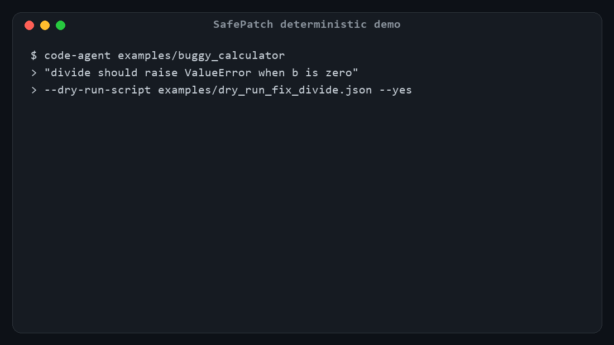
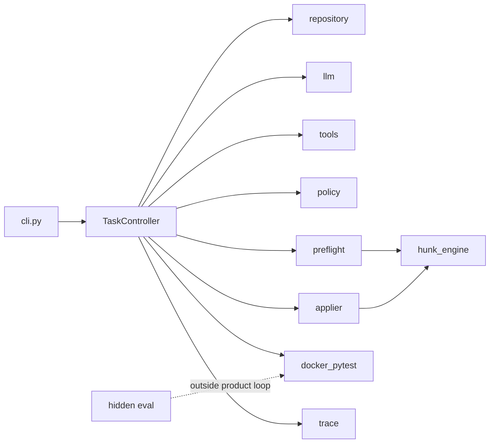

# SafePatch

[](https://github.com/majiali423/code-agent/actions/workflows/ci.yml)

[English](README.md) | [中文](README_zh.md)

SafePatch is a reliability-focused code-repair agent for small local
Python repositories that use pytest.

Given a repository path and a bug report or change request, SafePatch
creates an isolated working copy, builds a lightweight AST-based
repository map, runs a baseline test suite, and lets the model inspect
the repository through a restricted set of read-only tools.

Proposed unified diffs are validated against repository and test
integrity policies, checked with an exact patch preflight, and presented
for approval before they are applied. Approved changes are tested in a
network-disabled, resource-limited Docker container. Each session
exports the final diff, public and hidden evaluation logs, structured
metrics, and an append-only execution trace.

## Frozen Evidence at a Glance

| Real historical bugs | Independent runs | Public tests | Public + hidden | Test files changed | Apply failures after preflight |
|---:|---:|---:|---:|---:|---:|
| 7 | 21 | 19/21 | **17/21 (81.0%)** | 0 | 0 |

This is a frozen, small-sample experiment using one model, not a claim of
general production accuracy. The committed evidence contains sanitized
per-run outcomes, usage, cost, submitted failure patches, and hidden-test logs.
It can be checked without a model account or Docker:

```bash
python examples/real_bug_benchmark/verify_published_results.py
```

[Browse the public evidence](examples/real_bug_benchmark/published/synthesis-21-run/README.md)
· [Read the full report](examples/real_bug_benchmark/SYNTHESIS_MODEL_EVAL_REPORT.md)
· [Study two honest failure cases](docs/FAILURE_CASE_STUDY.md)

## Deterministic Demo



The replay uses no API key, but exercises the real isolation, policy,
preflight, approval, exact-apply, Docker pytest, and artifact paths. It
starts from a failing test and finishes `SUCCEEDED` after one repair
attempt. After installing the package, reproduce it with:

```powershell
code-agent examples\buggy_calculator `
  "divide raises ZeroDivisionError on b==0; it should raise ValueError." `
  --dry-run-script examples\dry_run_fix_divide.json --yes
```

## Overview

SafePatch prioritizes **controllable repair** over open-ended autonomy.
The product path is intentionally narrow:

- one local Python + pytest repository at a time
- no shell, browser, or network tools for the model
- policy validation and exact patch preflight before approval
- Docker pytest as the regression runner for repair attempts; a green baseline
  alone is not an independent request oracle
- product session status separated from hidden-test evaluation status

Current product tag: **v0.3.1**. The reliability changes described below are
unreleased working-tree improvements, not a published release.

## Motivation

LLM-generated unified diffs often fail for reasons other than incorrect
business logic: hallucinated context lines, policy-violating test edits,
or environment failures. If every failed apply is counted as a repair
attempt, sessions look like “the model cannot fix the bug” when the
failure was really **inapplicable patch text**.

SafePatch separates:

| Counter | Meaning |
|---|---|
| Format retries | Invalid JSON / tool schema |
| Patch regeneration | Legal proposal that fails exact preflight |
| Repair attempts | Patch applied successfully and pytest started |

## Key Capabilities

- Isolated `working_copy` import (source repository is not modified)
- AST repository map and bounded read-only tools
- Unified-diff and exact `old_text -> new_text` proposals with shared policy checks
- Rich mismatch diagnostics and mandatory stale-region re-reads before regeneration
- Safe relocation only for a complete, unique exact hunk block (no fuzzy apply)
- Per-file SHA-256 revisions from read through preflight and apply
- Human approval bound to `patch_hash` and `working_tree_hash`
- Docker pytest with network disabled, memory/CPU/pids limits, non-root user, timeout classification
- Append-only redacted `trace.jsonl` plus session artifacts
- Optional hidden-test evaluation outside the agent loop

## Workflow

```text
import working_copy
→ repository map + baseline Docker pytest
→ model tool loop (read-only)
→ propose_patch or revision-bound propose_edit
→ policy validation
→ exact patch preflight
   ├── mismatch → diagnostic + mandatory re-read → regenerate (not a repair attempt)
   ├── shifted unique exact block → safe relocation
   └── applicable → approval (hash-bound)
→ exact apply
→ attempts_used += 1
→ Docker pytest
→ export artifacts
```

Hidden tests, when used, run only after product success on an evaluation
copy and never feed back into the agent prompt or repair loop.

## Architecture



Core package layout:

| Area | Role |
|---|---|
| `code_agent/controller.py` | Session state machine |
| `code_agent/patching/` | Proposal, policy, preflight, exact apply |
| `code_agent/runtime/` | Docker pytest runner and run config |
| `code_agent/repository/` | Import, repo map, diffs |
| `code_agent/tools/` | Read-only model tools |
| `code_agent/eval/` | Hidden-test evaluation (not part of the agent loop) |

See [Architecture](docs/ARCHITECTURE.md) for modules, call chain, and
failure classification.

## Reliability Model

- **Exact matching only** — relocation requires one complete, unique exact block
- **Fresh context** — mismatch recovery requires a covering read; edits bind to file revisions
- **Analysis state machine** — 12 fixed exploration reads, then `SYNTHESIZE`; the experimental `request_evidence` path allows at most two explicit missing-range requests before proposal or finish
- **Inapplicable patches never enter approval** and never increment repair attempts
- **Budget** — initial patch + up to 2 regenerations per window; exhaustion → `PATCH_NOT_APPLICABLE`
- **Approval binding** — working-tree change after approval → `PATCH_BASE_CHANGED`
- **Environment vs logic** — Docker timeouts / daemon errors are distinct terminal statuses
- **Test integrity** — modifying existing tests is blocked by default (`--allow-test-changes` is explicit high risk)

Design notes: [Patch Applicability](docs/V0.3_PATCH_APPLICABILITY.md) and
[Safe Patch Recovery](docs/PATCH_RECOVERY.md).

## Security Boundaries

- Model tools cannot request shell, Docker, direct file writes, browser, or network access
- Docker pytest cannot use the network and runs against a disposable writable test
  copy with `--network none`, capability drop, no-new-privileges, a read-only
  container root, non-root UID, resource caps, and `--rm`. This is
  defense-in-depth isolation, not a claim of a complete security sandbox.
- The configured LLM provider API does require host network access. Repository maps,
  selected source snippets, tracebacks, and proposed diffs may be sent to that
  provider. A local OpenAI-compatible endpoint can reduce code disclosure.
- "Local repository" describes where the repository starts; it does not mean all
  inference is offline.
- Host API keys are not passed into the container
- Trace recording redacts secret-like strings
- Source tree remains untouched; only `working_copy` is patched

## Evaluation

SafePatch v0.3 was evaluated on a frozen 12-task benchmark covering
single-file fixes, multi-file fixes, red-herring files, boundary cases,
test-integrity constraints, and hidden-test generalisation.

| Metric | Result |
|---|---|
| Runs | 36 |
| Public tests passed | 36/36 |
| Hidden tests passed | 36/36 |
| First patch applicable | 34/36 |
| Sessions requiring regeneration | 2/36 |
| Regeneration recovery | 2/2 |
| Apply failures after preflight | 0 |
| Missing, unrelated or forbidden changes | 0 |

The benchmark uses small dependency-free Python repositories and one
model provider. These results demonstrate reliability on the evaluated
scope, not general production readiness.

Evidence:

- [Full12 × 3 report](examples/llm_benchmark/FULL12_V03_X3_REPORT.md)
- [Mismatch replay (mechanism proof)](examples/llm_benchmark/REPLAY_V03_REPORT.md)
- Product tag `v0.3.1` (historical Full12 evidence frozen at `v0.3.0` / `benchmark-v0.3-deepseek-full12-x3`)

### Real-repository benchmark

A frozen [BugsInPy](https://github.com/soarsmu/bugsinpy) set complements the
micro-suite. All seven frozen environments (five single-file and two natural
multi-file tasks) are accepted. For each, the full buggy
repository fails the public upstream regression test for the expected reason,
while the fixed revision passes in the same pinned, offline Docker image.

In the 15-run V4-Flash study, SafePatch passed 14/15 tasks with preflight and
9/15 without it. The six-run stratified V4-Pro check passed 6/6. These are small,
non-paired samples and are reported as engineering evidence, not a general model
leaderboard.

The next benchmark revision adds post-repair hidden semantic tests and two
Docker-accepted natural multi-file tasks (`tornado-10` and `thefuck-16`). A
separate 2-task x 2-run V4-Flash pilot initially passed public and hidden tests
in 1/4 runs; the same small-sample setup passed 3/4 after safe patch-recovery
changes. Both remain outside the historical single-file denominators.

The frozen analysis-state-machine candidate was then run three times on each of
all seven accepted tasks: public tests passed 19/21 and public-plus-hidden scoring
passed 17/21 (81.0%). No test files were modified and no post-preflight apply
failed. `request_evidence` was used in only 1/21 runs and did not make that run
successful, so it remains an experimental mechanism rather than a claimed source
of accuracy improvement.

A separate frozen, interleaved preflight comparison ran all seven tasks twice
per condition (28 runs). Enabled finished 11/14 and disabled finished 9/14, but
there were zero preflight rejections and zero apply failures in either condition.
The observed outcome difference therefore cannot be attributed to preflight;
the experiment is retained as useful negative evidence rather than advertised as
an accuracy gain.

Verify the committed 21-run result without Docker or an API key:

```bash
python examples/real_bug_benchmark/verify_published_results.py
```

To rebuild and test every pinned historical environment, use
`python examples/real_bug_benchmark/verify.py` (Docker required).

Verify the published preflight comparison independently:

```bash
python examples/real_bug_benchmark/verify_preflight_ablation.py
```

See the [acceptance report](examples/real_bug_benchmark/ACCEPTANCE_REPORT.md),
[benchmark design](examples/real_bug_benchmark/DESIGN.md), and
[model evaluation report](examples/real_bug_benchmark/MODEL_EVAL_REPORT.md).
The focused results are in the
[multi-file model report](examples/real_bug_benchmark/MULTIFILE_MODEL_EVAL_REPORT.md).
The frozen 21-run result is in the
[synthesis state-machine report](examples/real_bug_benchmark/SYNTHESIS_MODEL_EVAL_REPORT.md),
with a [sanitized public evidence bundle](examples/real_bug_benchmark/published/synthesis-21-run/README.md)
and an [annotated failure case study](docs/FAILURE_CASE_STUDY.md). The controlled
comparison has a [full interpretation report](examples/real_bug_benchmark/PREFLIGHT_CONTROLLED_COMPARISON_REPORT.md)
and a [sanitized 28-run bundle](examples/real_bug_benchmark/published/preflight-ablation-28-run/README.md).

## Quick Start

```bash
pip install -e ".[dev]"
```

```powershell
docker info
code-agent --build-image
code-agent --docker-check
```

```powershell
copy .env.example .env
# Set OPENAI_API_KEY / OPENAI_BASE_URL / CODE_AGENT_MODEL as needed
```

## CLI Usage

Deterministic demo (dry-run script, no API key):

```powershell
code-agent examples\buggy_calculator `
  "divide raises ZeroDivisionError on b==0; it should raise ValueError." `
  --dry-run-script examples\dry_run_fix_divide.json `
  --yes
```

Live model run: omit `--dry-run-script`. Use `--yes` only when automatic
approval is acceptable.

Exit codes (selected):

| Code | Status |
|---|---|
| 0 | `SUCCEEDED` |
| 3 | `REJECTED` |
| 4 | `TEST_ENVIRONMENT_ERROR` / `TEST_TIMEOUT` |
| 5 | `MODEL_OUTPUT_INVALID` |
| 6 | `PATCH_NOT_APPLICABLE` |
| 7 | `PATCH_BASE_CHANGED` |
| 8 | `READ_BUDGET_EXHAUSTED` |
| 9 | `TESTS_PASSED_UNVERIFIED` (tests green, request lacks an independent oracle) |

More detail: [Demo](docs/DEMO.md).

## Output Artifacts

Per session under the session `artifacts/` directory:

| Artifact | Description |
|---|---|
| `final.diff` | Unified diff vs import snapshot |
| `summary.json` | Status, counters, changed files, observability card |
| `trace.jsonl` | Append-only execution events (redacted) |
| `baseline.log` / `attempt-*.log` | Pytest logs |
| `hidden.log` / `eval_trace.jsonl` | Present when hidden evaluation runs |

### Session Observability

Each `summary.json` includes an `observability` object with wall-clock
timestamps, monotonic `duration_ms`, model/tool/pytest counters, and
provider token usage when the API returns it (otherwise `null` — never
estimated). SafePatch does not send external telemetry. Details:
[Session Observability](docs/SESSION_OBSERVABILITY.md).

Example (truncated):

```json
{
  "summary_schema_version": 1,
  "status": "SUCCEEDED",
  "attempts_used": 1,
  "observability": {
    "duration_ms": 12050,
    "model": {
      "provider": "openai_compatible",
      "name": "deepseek-chat",
      "tool_calling_protocol": "custom_json",
      "calls": 4,
      "usage": {
        "prompt_tokens": 1200,
        "completion_tokens": 350,
        "total_tokens": 1550,
        "cached_tokens": null,
        "source": "provider",
        "available": true,
        "complete": true,
        "calls_with_usage": 4,
        "calls_without_usage": 0
      }
    },
    "retries": {
      "format": 0,
      "patch_regeneration": 0,
      "repair_attempts": 1
    },
    "tests": {
      "baseline_runs": 1,
      "post_apply_runs": 1,
      "total_runs": 2
    }
  }
}
```

## Project Scope

In scope:

- Small local Python repositories with pytest
- Controlled repair with human approval
- Exact unified-diff application
- Docker-isolated public tests and optional hidden evaluation

Out of scope (v0.3):

- MCP, automatic PR / push / commit, multi-agent orchestration
- Frontend, multilingual product UI
- Online dependency installation inside the test container
- Fuzzy patch application or context guessing
- Feeding hidden-test failures back into the agent loop

## Known Limitations

- Benchmark coverage is a fixed micro-suite; scores are not proof of
  production readiness on arbitrary repositories
- The historical Full12 x3 result used one model on self-authored fixed micro-tasks;
  the frozen manifest detects task, hidden-test, prompt, and runner drift. It is not
  production proof and is not rewritten when current product semantics change.
- Model sampling varies; regeneration paths may or may not appear in a
  given live run
- Symlink edge-case tests may be skipped on hosts that cannot create
  symlinks
- The real-bug benchmark remains a seven-task small sample and should not be
  interpreted as a universal model leaderboard

## Repository Structure

```text
code_agent/                 Product package
docs/                       Design and operator documentation
examples/buggy_calculator/  Minimal demo repository
examples/dry_run_*.json     Deterministic tool scripts
examples/eval_tasks/        Hidden-eval samples
examples/llm_benchmark/     Frozen benchmark assets and reports
examples/real_bug_benchmark/ Real-repository benchmark environments
tests/                      Unit / integration / Docker E2E tests
```

## Documentation

| Document | Description |
|---|---|
| [中文 README](README_zh.md) | Chinese edition of this page |
| [Architecture](docs/ARCHITECTURE.md) | Modules, workflow, reliability choices |
| [Session Observability](docs/SESSION_OBSERVABILITY.md) | Per-session counters, tokens, duration |
| [Patch Applicability](docs/V0.3_PATCH_APPLICABILITY.md) | Preflight / regeneration design |
| [Demo](docs/DEMO.md) | End-to-end demonstration guide |
| [Real-bug Benchmark](examples/real_bug_benchmark/DESIGN.md) | Frozen selection and environment acceptance protocol |
| [Preflight Controlled Comparison](examples/real_bug_benchmark/PREFLIGHT_CONTROLLED_COMPARISON_REPORT.md) | Honest interpretation of the frozen 28-run on/off experiment |
| [Failure Case Study](docs/FAILURE_CASE_STUDY.md) | Why two public-test passes failed hidden semantics |
| [Walkthrough](docs/WALKTHROUGH.md) | Conceptual end-to-end explanation |
| [Next Release Notes](docs/NEXT_RELEASE_NOTES.md) | Unreleased reliability work; no version commitment |
| [v0.2 Release Notes](docs/V0.2_RELEASE_NOTES.md) | Prior release notes |
| [Acceptance Report](docs/ACCEPTANCE_REPORT.md) | Verification layers (historical) |

## Development

```bash
pip install -e ".[dev]"
python -m pytest
```

Current acceptance snapshot (2026-08-01): 191 tests collected; 190 passed and
1 host-specific test skipped, with all 7 Docker E2E tests executed. P0 coverage includes fail-closed approval,
exact declared/actual file-set matching, green-baseline verification semantics,
and disposable Docker test-copy isolation.

Docker-dependent negative E2E:

```bash
python -m pytest -m docker_e2e
```

Do not commit `.env`, session directories, or `examples/llm_benchmark/results/`.

## License

The repository owner has not selected or published an open-source license.
Until that decision is made, do not assume permission beyond applicable law.
