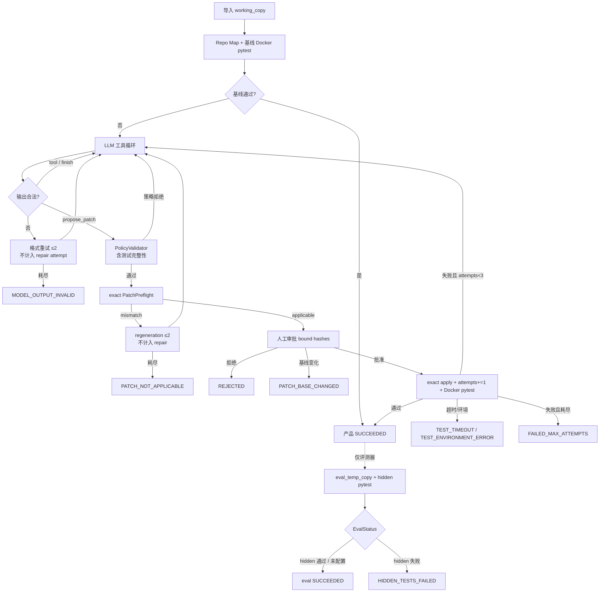

# code-agent — SafePatch MVP v0.3

面向**小型本地 Python + pytest 仓库**的可靠性导向、受控代码修复 Agent。

**状态：MVP v0.3**（Patch Applicability / exact preflight · 格式重试 · 测试完整性 · 隐藏评测隔离 · Docker 负向 E2E）

用户输入本地仓库路径 + Bug/需求描述后，系统完成：

仓库导入 → Repo Map / 基线测试 → 工具循环 → 补丁提案 → 策略校验 → **exact preflight** → 人工审批 → Docker pytest → 最多三轮 repair → 导出产物

- v0.3 Patch Applicability：[`docs/V0.3_PATCH_APPLICABILITY.md`](docs/V0.3_PATCH_APPLICABILITY.md)
- 架构与面试讲解：[`docs/ARCHITECTURE_AND_INTERVIEW.md`](docs/ARCHITECTURE_AND_INTERVIEW.md)
- 2 分钟 Demo 脚本：[`docs/DEMO_2MIN.md`](docs/DEMO_2MIN.md)
- v0.2 发布说明：[`docs/V0.2_RELEASE_NOTES.md`](docs/V0.2_RELEASE_NOTES.md)
- 走读：[`docs/FIRST_VERSION_WALKTHROUGH.md`](docs/FIRST_VERSION_WALKTHROUGH.md)

---

## Evaluation

SafePatch v0.3 was evaluated on a frozen 12-task benchmark covering single-file fixes, multi-file fixes, red-herring files, boundary cases, test-integrity constraints, and hidden-test generalisation.

| Metric | Result |
|---|---|
| Runs | 36 |
| Public tests passed | 36/36 |
| Hidden tests passed | 36/36 |
| First patch applicable | 34/36 |
| Sessions requiring regeneration | 2/36 |
| Regeneration recovery | 2/2 |
| Apply failures after preflight | 0 |
| Missing, unrelated or forbidden changes | 0 |

The benchmark uses small dependency-free Python repositories and one model provider. These results demonstrate reliability on the evaluated scope, not general production readiness.

Evidence: [`examples/llm_benchmark/FULL12_V03_X3_REPORT.md`](examples/llm_benchmark/FULL12_V03_X3_REPORT.md), mismatch-replay proof [`examples/llm_benchmark/REPLAY_V03_REPORT.md`](examples/llm_benchmark/REPLAY_V03_REPORT.md). Product tag `v0.3.0`; benchmark tag `benchmark-v0.3-deepseek-full12-x3`.

---

## 架构与状态 / 评测流程



要点：

- **产品**只看 `summary.status`（`SessionStatus`）。
- **评测**另有 `metrics.eval_status`（`EvalStatus`）；hidden 失败不反馈 Agent、不触发新修复轮。
- format retry、patch regeneration、repair attempt **三类计数分离**。

---

## 能力边界（请按此诚实对外表述）

### 已具备并已验证

- 小型本地 Python 仓导入 `working_copy`（原仓不被修改）
- AST Repo Map + 受限只读工具 + dry-run / LLM 工具循环
- unified diff 提案、策略校验、**exact preflight**（与 PatchApplier 共用 matcher，无 fuzzy）、人工审批后应用
- 结构化输出非法时的 format retry + 脱敏截断 trace；CLI 退出码 5；`PATCH_NOT_APPLICABLE`=6；`PATCH_BASE_CHANGED`=7
- 控制器固定参数的 Docker pytest：禁网、512MB、1 CPU、pids=128、非 root、`--rm`、默认 120s
- **真实 Docker 负向 E2E**：禁网生效、非 root、超时独立分类、容器清理
- 隐藏测试评测与产品运行**物理隔离**（`<task>.hidden/` + `eval_temp_copy`）
- 产物：`final.diff`、公开测试日志、`trace.jsonl`；评测另有 `hidden.log` / `eval_trace.jsonl` / `metrics.json`

### 评测说明（勿误读）

- 单元回归：以当前仓库 `pytest` 为准（含 patch-preflight 验收）
- `sample02_normalize` 使用**固定 dry-run 硬编码补丁**验证隐藏测试基础设施，**不代表真实 LLM 表现**
- Full12 × 3 见上方 **Evaluation**；v0.2 单轮 Full12（10/12）为历史基线，**不是**严格同随机样本 A/B

### 当前不支持（v0.3 仍冻结）

- MCP、GitHub Issue、自动 clone、自动 PR / push / commit
- 多 Agent、前端、多语言
- 容器内在线安装仓库依赖、任意 Shell、浏览器
- fuzzy patch apply / 猜位置
- Hidden 失败回灌产品循环（刻意禁止）

---

## 安装

```bash
pip install -e ".[dev]"
```

## 真实 Docker 演示

```powershell
docker info
code-agent --build-image
code-agent --docker-check

code-agent examples\buggy_calculator `
  "divide 函数在除数为 0 时应该抛出 ValueError，但现在抛出了 ZeroDivisionError，请修复。" `
  --dry-run-script examples\dry_run_fix_divide.json `
  --yes
```

配置真实模型（OpenAI 兼容，含 DeepSeek）：

```powershell
copy .env.example .env
# 编辑 .env
```

```env
OPENAI_API_KEY=sk-你的密钥
OPENAI_BASE_URL=https://api.deepseek.com
CODE_AGENT_MODEL=deepseek-chat
```

`.env`、session 目录、`examples/llm_benchmark/results/` 已被 gitignore。真实模型运行时去掉 `--dry-run-script`。

可选高风险开关：`--allow-test-changes`（默认关闭；仍禁止删测试 / 改 conftest 与 pytest 配置 / skip 与 `assert True` 等）。

隐藏评测样例（dry-run，需 Docker）：

```powershell
python examples\eval_tasks\run_hidden_samples.py
```

## 架构借鉴

| 开源项目 | 借鉴点 |
|---|---|
| mini-SWE-agent | 线性 Agent 循环 |
| Aider | Repo Map + unified diff |
| SWE-agent | TaskSession / trace |
| OpenHands | Agent 与 Runtime 分离 |
| goose | 写操作人工审批 |
