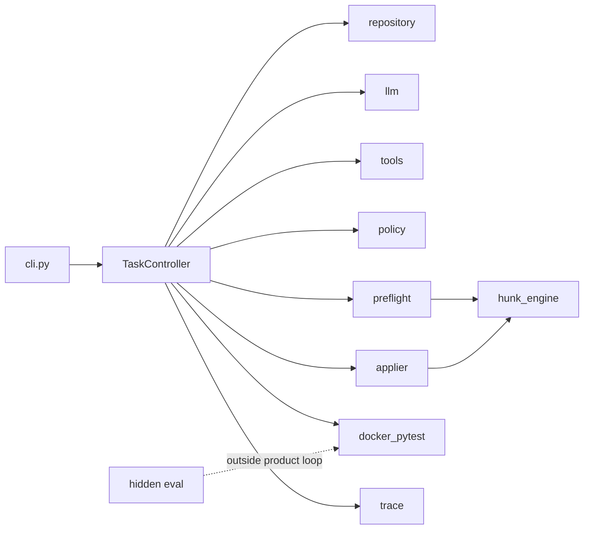

# SafePatch

[](https://github.com/majiali423/code-agent/actions/workflows/ci.yml)

[English](README.md) | 中文

SafePatch 是面向小型本地 Python（pytest）仓库的、以可靠性为优先的代码修复 Agent。

给定仓库路径与缺陷/变更描述后，SafePatch 会创建隔离的工作副本，构建基于 AST 的轻量仓库地图，运行基线测试，并通过一组受限的只读工具让模型检查仓库。

模型提出的 unified diff 会先经过仓库与测试完整性策略校验，再经精确补丁预检（exact patch preflight），通过后才提交人工审批。获批变更在禁用网络、资源受限的 Docker 容器中执行测试。每次会话导出最终 diff、公开/隐藏评测日志、结构化指标，以及只追加的执行 trace。

## 冻结证据速览

| 真实历史 Bug | 独立运行 | 公开测试 | 公开 + 隐藏 | 修改测试文件 | Preflight 后 apply 失败 |
|---:|---:|---:|---:|---:|---:|
| 7 | 21 | 19/21 | **17/21（81.0%）** | 0 | 0 |

这是单一模型上的冻结小样本实验，不代表通用生产准确率。仓库内提交了脱敏后的
逐次运行结果、token、耗时、成本、失败补丁与隐藏测试日志；无需模型账号或 Docker
即可复算：

```bash
python examples/real_bug_benchmark/verify_published_results.py
```

[查看公开证据包](examples/real_bug_benchmark/published/synthesis-21-run/README.md)
· [阅读完整报告](examples/real_bug_benchmark/SYNTHESIS_MODEL_EVAL_REPORT.md)
· [查看两个诚实的失败案例](docs/FAILURE_CASE_STUDY.md)

## 确定性演示


该回放无需 API Key，但会经过真实的隔离导入、策略校验、精确预检、审批、补丁应用、Docker pytest 与产物导出路径。演示从失败测试开始，在一次 repair attempt 后以 `SUCCEEDED` 结束。安装项目后运行：

```powershell
code-agent examples\buggy_calculator `
  "divide raises ZeroDivisionError on b==0; it should raise ValueError." `
  --dry-run-script examples\dry_run_fix_divide.json --yes
```

## 概述

SafePatch 优先保证**可控修复**，而非开放式自治。产品路径刻意收窄：

- 每次只处理一个本地 Python + pytest 仓库
- 模型没有 shell / 浏览器 / 网络工具
- 审批前必须通过策略校验与精确补丁预检
- Docker pytest 是 repair attempt 的回归执行器；原本为绿的 baseline
  本身不是需求的独立验证 oracle
- 产品会话状态与隐藏测试评测状态分离

当前产品标签为 **v0.3.1**。下文可靠性改造仍是未发布的工作树改进，
不构成新版本发布声明。

## 动机

LLM 生成的 unified diff 经常因业务逻辑以外的原因失败：幻觉上下文行、违反策略的测试改动，或环境故障。若把每一次 apply 失败都计为 repair attempt，会话会表现为「模型修不好」，而真实原因往往只是**补丁文本不可精确应用**。

SafePatch 将计数分离如下：

| 计数 | 含义 |
|---|---|
| Format retries | 非法 JSON / 工具 schema |
| Patch regeneration | 合法 proposal，但精确预检失败 |
| Repair attempts | 补丁已成功应用并启动 pytest |

## 核心能力

- 隔离导入 `working_copy`（不修改源仓库）
- AST 仓库地图与有界只读工具
- Unified diff 与精确 `old_text → new_text` 提案，共用路径 / 规模 / 测试完整性策略
- 丰富的 mismatch 诊断；重新生成前强制覆盖失效区域的 `read_file`
- 仅当完整旧 hunk 在文件中唯一精确出现时安全重定位（无 fuzzy apply）
- 从读取、预检到应用均绑定逐文件 SHA-256 revision
- 人工审批绑定 `patch_hash` 与 `working_tree_hash`
- Docker pytest：禁网、内存/CPU/pids 限制、非 root、超时独立分类
- 只追加且脱敏的 `trace.jsonl` 与会话产物
- 可选的隐藏测试评测（在 Agent 循环之外）

## 工作流

```text
导入 working_copy
→ 仓库地图 + 基线 Docker pytest
→ 模型工具循环（只读）
→ propose_patch 或绑定 revision 的 propose_edit
→ 策略校验
→ 精确补丁预检
   ├── mismatch → 诊断 + 强制重读 → 重新生成（不计 repair attempt）
   ├── 完整旧代码块唯一精确出现 → 安全重定位
   └── applicable → 审批（绑定 hash）
→ 精确应用
→ attempts_used += 1
→ Docker pytest
→ 导出产物
```

启用隐藏测试时，仅在产品成功后于评测副本上运行，且结果永不回灌 Agent 提示或修复循环。

## 架构



核心包结构：

| 区域 | 职责 |
|---|---|
| `code_agent/controller.py` | 会话状态机 |
| `code_agent/patching/` | 提案、策略、预检、精确应用 |
| `code_agent/runtime/` | Docker pytest 运行器与配置 |
| `code_agent/repository/` | 导入、仓库地图、diff |
| `code_agent/tools/` | 只读模型工具 |
| `code_agent/eval/` | 隐藏测试评测（不属于 Agent 循环） |

模块、调用链与失败分类见 [Architecture](docs/ARCHITECTURE.md)。

## 可靠性模型

- **仅精确匹配** — 重定位要求完整代码块唯一精确出现
- **上下文新鲜度** — mismatch 后必须覆盖指定范围重读；编辑绑定逐文件 revision
- **分析状态机** — 固定 12 次探索后进入 `SYNTHESIZE`；实验性的 `request_evidence` 最多允许两次明确缺失范围申请，随后必须提案或结束
- **不可应用补丁不得进入审批**，也不得增加 repair attempts
- **预算** — 每窗口初次补丁 + 最多 2 次 regeneration；耗尽 → `PATCH_NOT_APPLICABLE`
- **审批绑定** — 批准后工作树变化 → `PATCH_BASE_CHANGED`
- **环境 vs 逻辑** — Docker 超时 / 守护进程错误为独立终态
- **测试完整性** — 默认禁止修改已有测试（`--allow-test-changes` 为显式高风险开关）

设计说明：[Patch Applicability](docs/V0.3_PATCH_APPLICABILITY.md)与
[安全补丁恢复](docs/PATCH_RECOVERY.md)。

## 安全边界

- 模型工具不能请求 shell、Docker、直接写文件、浏览器或网络访问。
- Docker pytest 禁止网络，并只挂载一次性、可写的测试副本；容器使用
  `--network none`、capability drop、no-new-privileges、只读根文件系统、
  非 root UID、资源上限与 `--rm`。这是纵深防御隔离，不是“完整安全沙箱”。
- 主机访问配置的 LLM provider API 仍需要网络。仓库地图、选取的源码片段、
  traceback 与 diff 可能发送给该提供商；可配置本地 OpenAI-compatible endpoint
  以降低代码外发。
- “本地仓库”不等于“全部推理离线”。
- 宿主 API Key 不传入容器
- Trace 会对疑似密钥字符串脱敏
- 源码树保持不变；仅修补 `working_copy`

## 评测

SafePatch v0.3 在冻结的 12 题基准上评测，覆盖单文件修复、多文件修复、红鲱文件、边界情况、测试完整性约束与隐藏测试泛化。

| 指标 | 结果 |
|---|---|
| Runs | 36 |
| Public tests passed | 36/36 |
| Hidden tests passed | 36/36 |
| First patch applicable | 34/36 |
| Sessions requiring regeneration | 2/36 |
| Regeneration recovery | 2/2 |
| Apply failures after preflight | 0 |
| Missing, unrelated or forbidden changes | 0 |

该基准使用小型无依赖 Python 仓库与单一模型提供方。结果仅说明在评测范围内的可靠性，**不能**证明通用生产能力。

证据：

- [Full12 × 3 报告](examples/llm_benchmark/FULL12_V03_X3_REPORT.md)
- [Mismatch 回放（机制证明）](examples/llm_benchmark/REPLAY_V03_REPORT.md)
- 产品标签 `v0.3.1`（历史评测冻结于 `v0.3.0` / `benchmark-v0.3-deepseek-full12-x3`）

### 真实仓库基准

一个冻结的 [BugsInPy](https://github.com/soarsmu/bugsinpy) 集合用于补充微型任务基准。
七个冻结环境（五个单文件、两个自然多文件任务）均已通过验收。每题都在完整
buggy 仓库上因预期原因无法通过上游公开回归测试，而 fixed revision 在同一套
锁定依赖、断网 Docker 环境中通过。

V4-Flash 的 15 次实验中，开启 preflight 通过 14/15，关闭后通过 9/15；
V4-Pro 的 6 次分层小样本通过 6/6。这些是小规模、非配对的工程证据，不作为
通用模型排行榜。

下一版基准已加入修复后才注入的隐藏语义测试；`tornado-10` 与
`thefuck-16` 两个自然多文件任务也已通过 Docker 环境验收。独立的 V4-Flash
两题各两次小样本最初公开与隐藏测试最终通过 1/4；加入安全补丁恢复机制后，
相同设置复测通过 3/4。两轮结果都不会追溯进入历史单文件任务成功率分母。

冻结的分析状态机候选版本随后在全部 7 个已验收任务上各运行 3 次：公开测试
通过 19/21，公开加隐藏的最终口径通过 17/21（81.0%）。没有修改测试文件，
preflight 后没有 apply 失败。`request_evidence` 只在 1/21 次运行中被采用，且
没有使该次运行成功，因此它仍是实验机制，不作为准确率提升来源宣传。

另一个冻结、交错顺序的 preflight 对照在 7 题上对每种条件各运行两次，共 28 次。
开启组最终通过 11/14，关闭组通过 9/14；但两组均未出现 preflight rejection 或
apply failure。因此观察到的差异不能归因于 preflight，本项目将其作为有价值的负结果
保留，而不宣传成准确率提升。

无需 Docker 或 API Key 即可验证已提交的 21 次实验结果：

```bash
python examples/real_bug_benchmark/verify_published_results.py
```

若要重建并测试全部锁定的历史项目环境，请运行
`python examples/real_bug_benchmark/verify.py`（需要 Docker）。

独立复算公开的 preflight 对照结果：

```bash
python examples/real_bug_benchmark/verify_preflight_ablation.py
```

详见[验收报告](examples/real_bug_benchmark/ACCEPTANCE_REPORT.md)、
[基准设计](examples/real_bug_benchmark/DESIGN.md)与
[模型评测报告](examples/real_bug_benchmark/MODEL_EVAL_REPORT.md)。本轮结果见
[多文件模型评测报告](examples/real_bug_benchmark/MULTIFILE_MODEL_EVAL_REPORT.md)和
[21 次状态机稳定性报告](examples/real_bug_benchmark/SYNTHESIS_MODEL_EVAL_REPORT.md)，以及
[脱敏公开证据包](examples/real_bug_benchmark/published/synthesis-21-run/README.md)和
[失败案例解析](docs/FAILURE_CASE_STUDY.md)。对照实验另见
[完整解读报告](examples/real_bug_benchmark/PREFLIGHT_CONTROLLED_COMPARISON_REPORT.md)和
[脱敏 28 次证据包](examples/real_bug_benchmark/published/preflight-ablation-28-run/README.md)。

## 快速开始

```bash
pip install -e ".[dev]"
```

```powershell
docker info
code-agent --build-image
code-agent --docker-check
```

```powershell
copy .env.example .env
# 按需设置 OPENAI_API_KEY / OPENAI_BASE_URL / CODE_AGENT_MODEL
```

## CLI 用法

确定性演示（dry-run 脚本，无需 API Key）：

```powershell
code-agent examples\buggy_calculator `
  "divide raises ZeroDivisionError on b==0; it should raise ValueError." `
  --dry-run-script examples\dry_run_fix_divide.json `
  --yes
```

真实模型运行：去掉 `--dry-run-script`。仅在可接受自动审批时使用 `--yes`。

部分退出码：

| 码 | 状态 |
|---|---|
| 0 | `SUCCEEDED` |
| 3 | `REJECTED` |
| 4 | `TEST_ENVIRONMENT_ERROR` / `TEST_TIMEOUT` |
| 5 | `MODEL_OUTPUT_INVALID` |
| 6 | `PATCH_NOT_APPLICABLE` |
| 7 | `PATCH_BASE_CHANGED` |
| 8 | `READ_BUDGET_EXHAUSTED` |
| 9 | `TESTS_PASSED_UNVERIFIED`（测试为绿，但需求缺少独立验证 oracle） |

更多细节见 [Demo](docs/DEMO.md)。

## 输出产物

每次会话位于 session 的 `artifacts/` 目录：

| 产物 | 说明 |
|---|---|
| `final.diff` | 相对导入快照的 unified diff |
| `summary.json` | 状态、计数器、变更文件、observability 卡片 |
| `trace.jsonl` | 只追加的执行事件（已脱敏） |
| `baseline.log` / `attempt-*.log` | Pytest 日志 |
| `hidden.log` / `eval_trace.jsonl` | 运行隐藏评测时存在 |

### Session Observability（会话可观测性）

每个 `summary.json` 含 `observability` 对象：墙上时钟时间戳、单调时钟
`duration_ms`、模型/工具/pytest 计数，以及 provider 返回时的 token usage
（未返回则为 `null`，从不按字符估算）。SafePatch **不**发送外部 telemetry。
详见 [Session Observability](docs/SESSION_OBSERVABILITY.md)。

示例（节选）：

```json
{
  "summary_schema_version": 1,
  "status": "SUCCEEDED",
  "attempts_used": 1,
  "observability": {
    "duration_ms": 12050,
    "model": {
      "provider": "openai_compatible",
      "name": "deepseek-chat",
      "tool_calling_protocol": "custom_json",
      "calls": 4,
      "usage": {
        "prompt_tokens": 1200,
        "completion_tokens": 350,
        "total_tokens": 1550,
        "cached_tokens": null,
        "source": "provider",
        "available": true,
        "complete": true,
        "calls_with_usage": 4,
        "calls_without_usage": 0
      }
    },
    "retries": {
      "format": 0,
      "patch_regeneration": 0,
      "repair_attempts": 1
    },
    "tests": {
      "baseline_runs": 1,
      "post_apply_runs": 1,
      "total_runs": 2
    }
  }
}
```

## 项目范围

范围内：

- 小型本地 Python + pytest 仓库
- 带人工审批的受控修复
- 精确 unified-diff 应用
- Docker 隔离的公开测试与可选隐藏评测

范围外（v0.3）：

- MCP、自动 PR / push / commit、多 Agent 编排
- 前端、多语言产品 UI
- 测试容器内在线安装依赖
- Fuzzy 补丁应用或上下文猜测
- 将隐藏测试失败回灌 Agent 循环

## 已知限制

- 基准为固定微任务集；分数不能证明任意仓库上的生产能力
- 模型采样会波动；某次真实运行未必触发 regeneration 路径
- 无法创建符号链接的主机可能跳过相关边界测试
- `pyproject.toml` 中的包版本可能滞后于 git tag；v0.3 文档以 git tag 为准

## 仓库结构

```text
code_agent/                 产品包
docs/                       设计与操作文档
examples/buggy_calculator/  最小演示仓库
examples/dry_run_*.json     确定性工具脚本
examples/eval_tasks/        隐藏评测样例
examples/llm_benchmark/     冻结基准资产与报告
examples/real_bug_benchmark/ 真实仓库基准环境
tests/                      单元 / 集成 / Docker E2E 测试
```

## 文档

| 文档 | 说明 |
|---|---|
| [Architecture](docs/ARCHITECTURE.md) | 模块、工作流、可靠性取舍 |
| [Session Observability](docs/SESSION_OBSERVABILITY.md) | 会话计数、token、耗时 |
| [Patch Applicability](docs/V0.3_PATCH_APPLICABILITY.md) | 预检 / regeneration 设计 |
| [Demo](docs/DEMO.md) | 端到端演示指南 |
| [真实 Bug 基准](examples/real_bug_benchmark/DESIGN.md) | 冻结选题与环境验收协议 |
| [Preflight 受控对照](examples/real_bug_benchmark/PREFLIGHT_CONTROLLED_COMPARISON_REPORT.md) | 冻结 28 次开关实验及克制结论 |
| [失败案例解析](docs/FAILURE_CASE_STUDY.md) | 为什么两个公开测试通过的补丁仍未满足隐藏语义 |
| [Walkthrough](docs/WALKTHROUGH.md) | 概念性端到端说明 |
| [下一版本说明](docs/NEXT_RELEASE_NOTES.md) | 未发布的可靠性改造，不承诺版本号 |
| [v0.2 Release Notes](docs/V0.2_RELEASE_NOTES.md) | 既有发布说明 |
| [Acceptance Report](docs/ACCEPTANCE_REPORT.md) | 验证层次（历史） |

## 开发

```bash
pip install -e ".[dev]"
python -m pytest
```

当前验收快照（2026-08-01）：收集 191 个测试；190 个通过、1 个主机相关测试
跳过，7 个 Docker E2E 均已真实执行。P0 覆盖包括审批 fail closed、声明/实际文件集合精确
一致、green baseline 验证语义，以及 Docker 一次性测试副本隔离。

依赖 Docker 的负向 E2E：

```bash
python -m pytest -m docker_e2e
```

请勿提交 `.env`、session 目录或 `examples/llm_benchmark/results/`。

## 许可证

仓库所有者尚未选择或发布开源许可证。在作出决定前，不应假定拥有适用法律之外的授权。
