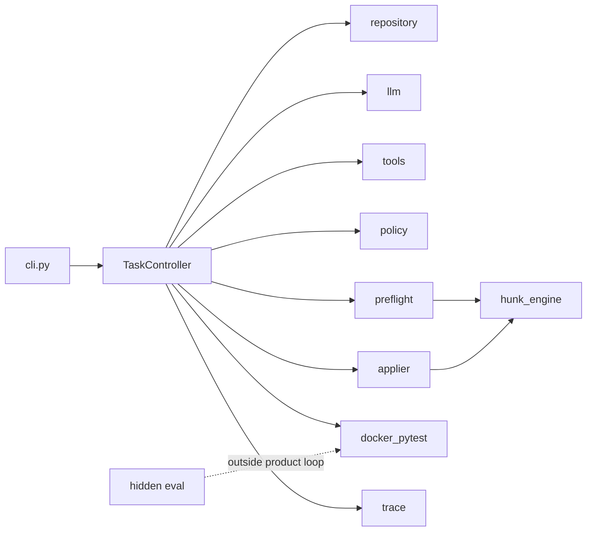

# SafePatch

[English](README.md) | 中文

SafePatch 是面向小型本地 Python（pytest）仓库的、以可靠性为优先的代码修复 Agent。

给定仓库路径与缺陷/变更描述后，SafePatch 会创建隔离的工作副本，构建基于 AST 的轻量仓库地图，运行基线测试，并通过一组受限的只读工具让模型检查仓库。

模型提出的 unified diff 会先经过仓库与测试完整性策略校验，再经精确补丁预检（exact patch preflight），通过后才提交人工审批。获批变更在禁用网络、资源受限的 Docker 容器中执行测试。每次会话导出最终 diff、公开/隐藏评测日志、结构化指标，以及只追加的执行 trace。

## 概述

SafePatch 优先保证**可控修复**，而非开放式自治。产品路径刻意收窄：

- 每次只处理一个本地 Python + pytest 仓库
- 模型没有 shell / 浏览器 / 网络工具
- 审批前必须通过策略校验与精确补丁预检
- Docker pytest 是 repair attempt 的唯一正确性判据
- 产品会话状态与隐藏测试评测状态分离

当前产品标签：**v0.3.1**（精确补丁预检 / patch regeneration；apply 失败分类）。

## 动机

LLM 生成的 unified diff 经常因业务逻辑以外的原因失败：幻觉上下文行、违反策略的测试改动，或环境故障。若把每一次 apply 失败都计为 repair attempt，会话会表现为「模型修不好」，而真实原因往往只是**补丁文本不可精确应用**。

SafePatch 将计数分离如下：

| 计数 | 含义 |
|---|---|
| Format retries | 非法 JSON / 工具 schema |
| Patch regeneration | 合法 proposal，但精确预检失败 |
| Repair attempts | 补丁已成功应用并启动 pytest |

## 核心能力

- 隔离导入 `working_copy`（不修改源仓库）
- AST 仓库地图与有界只读工具
- Unified diff 提案，含路径 / 规模 / 测试完整性策略校验
- 精确补丁预检，与 applier 共用同一 hunk matcher（无 fuzzy apply）
- 人工审批绑定 `patch_hash` 与 `working_tree_hash`
- Docker pytest：禁网、内存/CPU/pids 限制、非 root、超时独立分类
- 只追加且脱敏的 `trace.jsonl` 与会话产物
- 可选的隐藏测试评测（在 Agent 循环之外）

## 工作流

```text
导入 working_copy
→ 仓库地图 + 基线 Docker pytest
→ 模型工具循环（只读）
→ propose_patch
→ 策略校验
→ 精确补丁预检
   ├── mismatch → 结构化反馈 → 重新生成（不计 repair attempt）
   └── applicable → 审批（绑定 hash）
→ 精确应用
→ attempts_used += 1
→ Docker pytest
→ 导出产物
```

启用隐藏测试时，仅在产品成功后于评测副本上运行，且结果永不回灌 Agent 提示或修复循环。

## 架构



核心包结构：

| 区域 | 职责 |
|---|---|
| `code_agent/controller.py` | 会话状态机 |
| `code_agent/patching/` | 提案、策略、预检、精确应用 |
| `code_agent/runtime/` | Docker pytest 运行器与配置 |
| `code_agent/repository/` | 导入、仓库地图、diff |
| `code_agent/tools/` | 只读模型工具 |
| `code_agent/eval/` | 隐藏测试评测（不属于 Agent 循环） |

模块、调用链与失败分类见 [Architecture](docs/ARCHITECTURE.md)。

## 可靠性模型

- **仅精确匹配** — preflight 与 apply 共用 `hunk_engine`
- **不可应用补丁不得进入审批**，也不得增加 repair attempts
- **预算** — 每窗口初次补丁 + 最多 2 次 regeneration；耗尽 → `PATCH_NOT_APPLICABLE`
- **审批绑定** — 批准后工作树变化 → `PATCH_BASE_CHANGED`
- **环境 vs 逻辑** — Docker 超时 / 守护进程错误为独立终态
- **测试完整性** — 默认禁止修改已有测试（`--allow-test-changes` 为显式高风险开关）

设计说明：[Patch Applicability](docs/V0.3_PATCH_APPLICABILITY.md)。

## 安全边界

- 模型工具不能请求 shell、Docker 或网络
- Pytest 以 `--network none`、非 root UID、资源上限与 `--rm` 运行
- 宿主 API Key 不传入容器
- Trace 会对疑似密钥字符串脱敏
- 源码树保持不变；仅修补 `working_copy`

## 评测

SafePatch v0.3 在冻结的 12 题基准上评测，覆盖单文件修复、多文件修复、红鲱文件、边界情况、测试完整性约束与隐藏测试泛化。

| 指标 | 结果 |
|---|---|
| Runs | 36 |
| Public tests passed | 36/36 |
| Hidden tests passed | 36/36 |
| First patch applicable | 34/36 |
| Sessions requiring regeneration | 2/36 |
| Regeneration recovery | 2/2 |
| Apply failures after preflight | 0 |
| Missing, unrelated or forbidden changes | 0 |

该基准使用小型无依赖 Python 仓库与单一模型提供方。结果仅说明在评测范围内的可靠性，**不能**证明通用生产能力。

证据：

- [Full12 × 3 报告](examples/llm_benchmark/FULL12_V03_X3_REPORT.md)
- [Mismatch 回放（机制证明）](examples/llm_benchmark/REPLAY_V03_REPORT.md)
- 产品标签 `v0.3.1`（历史评测冻结于 `v0.3.0` / `benchmark-v0.3-deepseek-full12-x3`）

## 快速开始

```bash
pip install -e ".[dev]"
```

```powershell
docker info
code-agent --build-image
code-agent --docker-check
```

```powershell
copy .env.example .env
# 按需设置 OPENAI_API_KEY / OPENAI_BASE_URL / CODE_AGENT_MODEL
```

## CLI 用法

确定性演示（dry-run 脚本，无需 API Key）：

```powershell
code-agent examples\buggy_calculator `
  "divide raises ZeroDivisionError on b==0; it should raise ValueError." `
  --dry-run-script examples\dry_run_fix_divide.json `
  --yes
```

真实模型运行：去掉 `--dry-run-script`。仅在可接受自动审批时使用 `--yes`。

部分退出码：

| 码 | 状态 |
|---|---|
| 0 | `SUCCEEDED` |
| 3 | `REJECTED` |
| 4 | `TEST_ENVIRONMENT_ERROR` / `TEST_TIMEOUT` |
| 5 | `MODEL_OUTPUT_INVALID` |
| 6 | `PATCH_NOT_APPLICABLE` |
| 7 | `PATCH_BASE_CHANGED` |

更多细节见 [Demo](docs/DEMO.md)。

## 输出产物

每次会话位于 session 的 `artifacts/` 目录：

| 产物 | 说明 |
|---|---|
| `final.diff` | 相对导入快照的 unified diff |
| `summary.json` | 状态、计数器、变更文件、observability 卡片 |
| `trace.jsonl` | 只追加的执行事件（已脱敏） |
| `baseline.log` / `attempt-*.log` | Pytest 日志 |
| `hidden.log` / `eval_trace.jsonl` | 运行隐藏评测时存在 |

### Session Observability（会话可观测性）

每个 `summary.json` 含 `observability` 对象：墙上时钟时间戳、单调时钟
`duration_ms`、模型/工具/pytest 计数，以及 provider 返回时的 token usage
（未返回则为 `null`，从不按字符估算）。SafePatch **不**发送外部 telemetry。
详见 [Session Observability](docs/SESSION_OBSERVABILITY.md)。

示例（节选）：

```json
{
  "summary_schema_version": 1,
  "status": "SUCCEEDED",
  "attempts_used": 1,
  "observability": {
    "duration_ms": 12050,
    "model": {
      "provider": "openai_compatible",
      "name": "deepseek-chat",
      "tool_calling_protocol": "custom_json",
      "calls": 4,
      "usage": {
        "prompt_tokens": 1200,
        "completion_tokens": 350,
        "total_tokens": 1550,
        "cached_tokens": null,
        "source": "provider",
        "available": true,
        "complete": true,
        "calls_with_usage": 4,
        "calls_without_usage": 0
      }
    },
    "retries": {
      "format": 0,
      "patch_regeneration": 0,
      "repair_attempts": 1
    },
    "tests": {
      "baseline_runs": 1,
      "post_apply_runs": 1,
      "total_runs": 2
    }
  }
}
```

## 项目范围

范围内：

- 小型本地 Python + pytest 仓库
- 带人工审批的受控修复
- 精确 unified-diff 应用
- Docker 隔离的公开测试与可选隐藏评测

范围外（v0.3）：

- MCP、自动 PR / push / commit、多 Agent 编排
- 前端、多语言产品 UI
- 测试容器内在线安装依赖
- Fuzzy 补丁应用或上下文猜测
- 将隐藏测试失败回灌 Agent 循环

## 已知限制

- 基准为固定微任务集；分数不能证明任意仓库上的生产能力
- 模型采样会波动；某次真实运行未必触发 regeneration 路径
- 无法创建符号链接的主机可能跳过相关边界测试
- `pyproject.toml` 中的包版本可能滞后于 git tag；v0.3 文档以 git tag 为准

## 仓库结构

```text
code_agent/                 产品包
docs/                       设计与操作文档
examples/buggy_calculator/  最小演示仓库
examples/dry_run_*.json     确定性工具脚本
examples/eval_tasks/        隐藏评测样例
examples/llm_benchmark/     冻结基准资产与报告
tests/                      单元 / 集成 / Docker E2E 测试
```

## 文档

| 文档 | 说明 |
|---|---|
| [Architecture](docs/ARCHITECTURE.md) | 模块、工作流、可靠性取舍 |
| [Session Observability](docs/SESSION_OBSERVABILITY.md) | 会话计数、token、耗时 |
| [Patch Applicability](docs/V0.3_PATCH_APPLICABILITY.md) | 预检 / regeneration 设计 |
| [Demo](docs/DEMO.md) | 端到端演示指南 |
| [Walkthrough](docs/WALKTHROUGH.md) | 概念性端到端说明 |
| [v0.2 Release Notes](docs/V0.2_RELEASE_NOTES.md) | 既有发布说明 |
| [Acceptance Report](docs/ACCEPTANCE_REPORT.md) | 验证层次（历史） |

## 开发

```bash
pip install -e ".[dev]"
pytest
```

依赖 Docker 的负向 E2E：

```bash
pytest -m docker_e2e
```

请勿提交 `.env`、session 目录或 `examples/llm_benchmark/results/`。

## 许可证

本仓库尚未发布 SPDX 许可证文件。在添加许可证之前，请将代码视为 source-available。
