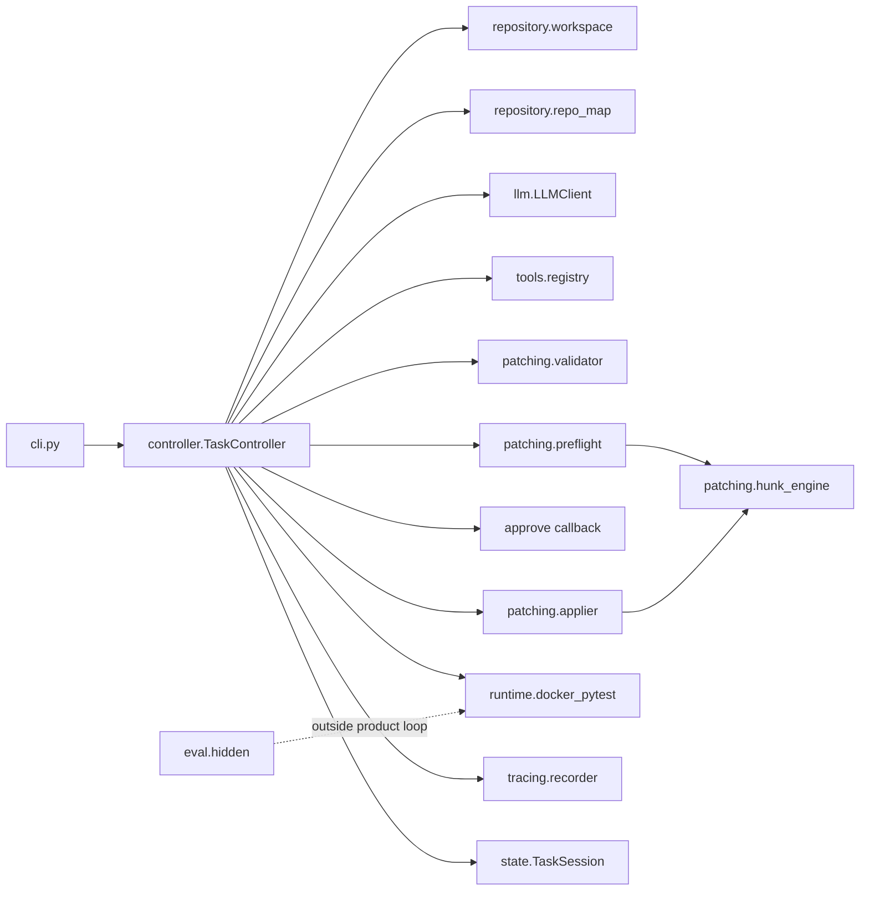

# SafePatch Architecture

Status: **Unreleased reliability design; current product tag v0.3.1**. This document describes system structure, session
workflow, module responsibilities, and reliability trade-offs. It is not a
substitute for reading the source under `code_agent/`.

## Positioning

SafePatch is a reliability-oriented local code-repair agent for small
Python + pytest repositories. The control path is:

**policy → exact preflight → human approval → Docker pytest**

Inapplicable unified diffs are rejected before approval and before repair
attempt accounting. The project is deliberately narrower than general
SWE-agent style systems: no model shell, no multi-agent orchestration, and
no fuzzy patch application.

## Module map

| Area | Path | Responsibility |
|---|---|---|
| Orchestration | `controller.py` | Session state machine |
| CLI | `cli.py` | Arguments, Docker preflight, approval UI, exit codes |
| State | `state.py` | `SessionStatus`, `TaskSession`, `ApprovalBinding`, summary counters |
| Model I/O | `llm.py` | System prompt, JSON tool-call parsing, format-retry hints, dry-run |
| Tools | `tools/*` | Read-only inspection; `propose_patch` / `finish` handled in controller |
| Policy | `patching/validator.py`, `test_integrity.py` | Path, size, test-integrity rules |
| Exact matcher | `patching/hunk_engine.py` | Sole unified-diff hunk matcher (no fuzzy) |
| Preflight | `patching/preflight.py`, `hashes.py` | Read-only apply simulation; content hashes |
| Apply | `patching/applier.py` | Backup, write, rollback on failure |
| Runtime | `runtime/docker_pytest.py` | Disposable test copy, network-none, limits, non-root, timeout kinds |
| Workflow policy | `workflow.py` | Fail-closed approval, verification classification, approved patch execution |
| Repository | `repository/*` | Import, repo map, snapshot diffs |
| Trace | `tracing/recorder.py` | JSONL events with secret redaction |
| Evaluation | `eval/hidden.py` | Hidden tests on `eval_temp_copy` only |

## `TaskController.run` call chain

1. **`import_repository`** — copy into session `working_copy`.
2. **`build_repo_map` + `snapshot_tree`** — structure for the model; baseline for `final.diff`.
3. **Baseline Docker pytest** — runs on a disposable copy; a green baseline is
   recorded but does not independently verify the requested change.
4. **Loop** while not terminal and `attempts_used < max_attempts`:
   - `_analyze_phase` — tool loop; on `propose_patch`: parse → policy → **preflight**
   - mismatch → patch regeneration (≤2), no `attempts_used` increment, no approval
   - success → `ApprovalBinding`
   - approval (hash-bound); tree change → `PATCH_BASE_CHANGED`
   - exact apply success → `attempts_used += 1` → pytest
5. **Finalize** — write `summary.json`, `final.diff`, close trace.

## Counter semantics

| Counter | Meaning |
|---|---|
| `format_retries` | Invalid JSON / tool schema |
| `patch_regeneration_retries` | Legal proposal that fails exact preflight |
| `repair_attempts` (`attempts_used`) | Successful apply followed by pytest |

Per-session machine-readable totals (model calls, tools, pytest runs,
tokens, monotonic duration) live under `summary.json` → `observability`.
See [Session Observability](SESSION_OBSERVABILITY.md).

## Selected terminal statuses

| Status | When |
|---|---|
| `SUCCEEDED` | A normal baseline failure was resolved and final tests passed |
| `TESTS_PASSED_UNVERIFIED` | Baseline and final tests passed, but no independent oracle verified the request |
| `FAILED_MAX_ATTEMPTS` | Applied patches exhausted; tests still failing |
| `PATCH_NOT_APPLICABLE` | Regeneration budget exhausted without an applicable patch |
| `PATCH_BASE_CHANGED` | Working tree hash changed after approval |
| `REJECTED` | Human rejected an applicable proposal, or a library caller omitted an approval handler (distinguished by `stop_reason`) |
| `MODEL_OUTPUT_INVALID` | Format retries exhausted |
| `READ_BUDGET_EXHAUSTED` | Synthesis ended through repeated no-progress actions, evidence hard violation, or the synthesis step limit |
| `TEST_ENVIRONMENT_ERROR` / `TEST_TIMEOUT` | Docker / pytest infrastructure failure |

Product `SessionStatus` is distinct from evaluator `EvalStatus` used for
hidden tests.

## Design trade-offs

1. **Shared exact matcher** — preflight and applier import the same
   `hunk_engine` functions so dry-run and write paths cannot diverge.
2. **No fuzzy apply** — wrong context fails loudly and is classifiable;
   silent nearby matching would hide model errors.
3. **Hash-bound approval** — prevents applying a diff against a tree the
   human did not review.
4. **Hidden evaluation isolation** — product success is not treated as
   generalisation proof; hidden failures never re-enter the agent loop.
5. **Docker test isolation** — each run mounts a disposable writable copy, so test
   side effects cannot enter `working_copy`, the next model context, or `final.diff`.
   The hardened container is defense in depth, not a complete security sandbox.
6. **Human approval by default** — `--yes` is explicit automation; test
   mutation requires `--allow-test-changes`.
7. **Green baseline caution** — model-authored tests are not an independent oracle;
   a green-to-green patch exits as `TESTS_PASSED_UNVERIFIED`.

## Failure classification (product vs patch quality)

| Observation | Typical class |
|---|---|
| Context / deletion mismatch in preflight | Inapplicable patch (`hallucinated_context`) |
| Policy / test-integrity errors | Policy blocked proposal |
| Apply failure after successful preflight | Rare race / base change (`patch_apply_failed_after_preflight`) |
| Pytest assertion failures after apply | Repair attempt failure |
| Docker daemon / timeout | Environment / timeout terminal status |

## Related documents

- [Patch Applicability (v0.3)](V0.3_PATCH_APPLICABILITY.md)
- [Demo](DEMO.md)
- [Walkthrough](WALKTHROUGH.md)
