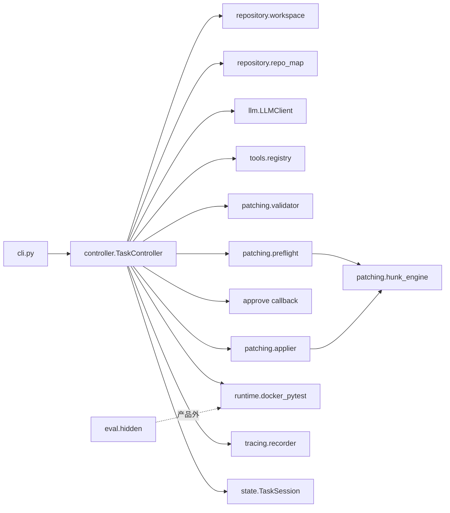

# SafePatch 架构图与面试讲解（从 controller 出发）

产品版本：`v0.3.0`（commit 见 Git tag）。本文用于自学走读与面试口述，不替代源码。

---

## 1. 一句话定位

SafePatch 是一个**可靠性优先**的本地代码修复 Agent：只修小型 Python+pytest 仓，强制 **policy → exact preflight → 人工审批 → Docker 测试**，把“能胡说的补丁”挡在写盘与计分之前。

面试加一句限制：范围是无依赖微仓 + 单模型评测；**不是**通用 SWE-agent / 生产平台。

---

## 2. 模块地图（从 `controller.py` 辐射）

| 模块 | 文件 | 职责 |
|---|---|---|
| 编排中枢 | `controller.py` | 状态机：导入→基线→分析→preflight→审批→apply→pytest→终态 |
| 入口 | `cli.py` | 参数、Docker preflight、审批 UI、`--yes`、退出码 |
| 状态 | `state.py` | `SessionStatus` / `TaskSession` / `ApprovalBinding` / summary 计数 |
| 模型 | `llm.py` | SYSTEM_PROMPT、JSON tool call 解析、format retry hint、dry-run |
| 工具 | `tools/*` | 只读：list/read/search/repo_map/diff；`propose_patch`/`finish` 由 controller 特判 |
| 策略 | `patching/validator.py` + `test_integrity.py` | 路径/规模/测试完整性 |
| 精确匹配 | `patching/hunk_engine.py` | **唯一** unified-diff hunk matcher（无 fuzzy） |
| Preflight | `patching/preflight.py` + `hashes.py` | 只读模拟 apply；绑定 `patch_hash`/`working_tree_hash` |
| 写盘 | `patching/applier.py` | backup → engine → 失败 rollback |
| 运行时 | `runtime/docker_pytest.py` | 禁网、限额、非 root、超时分类 |
| 仓面 | `repository/*` | 导入 working_copy、Repo Map、相对基线 diff |
| Trace | `tracing/recorder.py` | JSONL 事件、密钥脱敏 |
| 评测（产品外） | `eval/hidden.py` | hidden 在 `eval_temp_copy`，不回灌 Agent |

---

## 3. `TaskController.run` 主路径（必须能背）

1. **`import_repository`**：原仓只读复制到 session `working_copy`。
2. **`build_repo_map` + `snapshot_tree`**：给模型地图；快照用于最终 `final.diff`。
3. **基线 Docker pytest**：已绿则直接成功；环境/超时独立终态。
4. **循环**（`attempts_used < max_attempts` 且非终态）：
   - `_analyze_phase`：工具循环；`propose_patch` → policy → **preflight**
   - mismatch：`patch_regeneration`（≤2），**不** `attempts_used++`，**不**进审批
   - 成功：返回 `ApprovalBinding`
   - 审批（绑定 hash）；基线变 → `PATCH_BASE_CHANGED`
   - **exact apply 成功后**才 `attempts_used += 1`，再 pytest
5. **finalize**：写 `summary.json` / `final.diff` / trace 收尾。

三类计数（面试高频）：

| 计数 | 含义 |
|---|---|
| format_retries | 非法 JSON/schema |
| patch_regeneration_retries | 合法 proposal 但无法精确应用 |
| repair_attempts (`attempts_used`) | 已成功 apply 并启动 pytest |

---

## 4. 关键设计决策（为什么这样）

1. **Exact preflight 与 applier 共用 `hunk_engine`**  
   避免“预检过了 apply 不过”的双实现漂移；明确拒绝 fuzzy。

2. **审批绑定 hash**  
   防止审批后工作树被改仍按旧 diff 写入（`PATCH_BASE_CHANGED`）。

3. **Hidden 评测物理隔离**  
   产品成功 ≠ 泛化成功；hidden 不进 prompt，防止过拟合公开测试。

4. **Docker 作为唯一测试真源**  
   禁网/非 root/超时分类，把“环境故障”与“修不好”分开。

5. **人工审批默认在环**  
   `--yes` 仅自动化；高风险测试改动需显式 `--allow-test-changes`。

---

## 5. 面试 3 分钟口述稿

> 我做的 SafePatch 解决的是：让 LLM 改代码时别靠“瞎试补丁”消耗修复次数。  
> 入口是 CLI，核心是 `TaskController`。它先把仓库拷到 working_copy，跑 Docker 基线测试，再进入只读工具循环。模型提出 unified diff 后，先过策略（含测试完整性），再过与 PatchApplier **同一套** exact hunk preflight；过不了就结构化反馈让它重读文件再生成，这叫 regeneration，**不计 repair**。只有 preflight 成功才给人审批，审批绑定 patch/工作树 hash，然后精确 apply，成功后才 `attempts_used++` 并跑 Docker pytest。  
> 评测上我们冻了 12 个微任务跑 DeepSeek 三轮共 36 次，公开和隐藏测试都过了，但第一次补丁可应用率是 34/36，有 2 次靠 regeneration 恢复；这只能说明在该范围内可靠，不能外推到任意仓库。

追问准备：

- Q: 和 Aider/SWE-agent 区别？  
  A: 更窄、更可控：无 shell、无多 Agent、强制 preflight/审批/Docker 隔离；换可靠性不换能力面。
- Q: 为什么不做 fuzzy apply？  
  A: fuzzy 会掩盖模型上下文错误，破坏可审计性；我们要失败可分类（`hallucinated_context` vs 测试失败）。
- Q: repair 与 regeneration 为何分开？  
  A: 否则 v0.2 会出现“三次 context mismatch → FAILED_MAX_ATTEMPTS”，误判为修不好。

---

## 6. 建议自学顺序（从 controller 开始）

1. `controller.py`：`run` → `_analyze_phase` → `_run_preflight`  
2. `state.py`：终态与 summary 字段  
3. `patching/hunk_engine.py` → `preflight.py` → `applier.py`  
4. `patching/validator.py` / `test_integrity.py`  
5. `runtime/docker_pytest.py` / `docker_config.py`  
6. `llm.py` + `tools/registry.py`  
7. `eval/hidden.py`（强调产品外）  
8. `examples/llm_benchmark/*`（评测如何冻结与计量）

每读完一块，对照一次 dry-run Demo 的 `trace.jsonl` 事件名。
